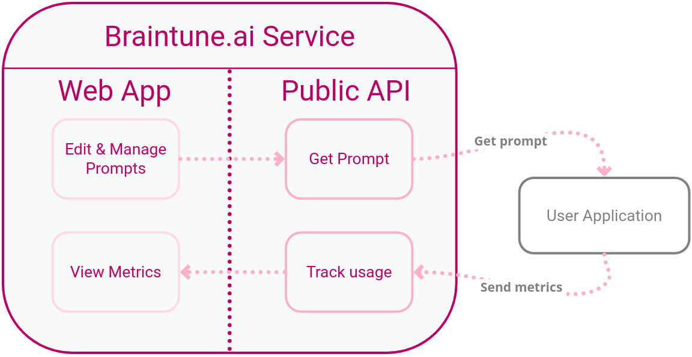

# Braintune and Langchain Integration Guide

This guide provides examples and instructions to help you integrate [Braintune](https://braintune.ai/) with Langchain, 
a framework for building language model-powered applications. 
By following the step-by-step tutorials in this guide, you will learn how to enhance a simple question-answering script with Braintune LLMops functions.

[Braintune](https://docs.braintune.ai/) is a prompt engineering and management tool developed to address the growing need for a streamlined workflow
in managing LLM prompts. 

The repository contains code and instructions for integrating Braintune with Langchain in two ways:

1. [Improve Question Answering with Braintune & Langchain](./braintune-langchain-start.md): Preparation and indexing of documents for a question answering application.
2. [Track Prompt Usage and Gain Insights](./braintune-langchain-prompt-monitoring.md): Monitor prompt usage and gather insights on your prompts' performance in the [Braintune UI](https://docs.braintune.ai/prompt-metrics).
3. [Integrate Braintune Prompts with Langchain](./braintune-langchain-full-integration.md): Full integration of Braintune prompts in a Langchain application, including both using [Playground](https://docs.braintune.ai/prompt-playground) and [metrics](https://docs.braintune.ai/prompt-metrics).

## Getting Started

To set up the Braintune and Langchain integration, follow these steps:

1. Clone the repository and install dependencies in a virtual environment.

2. Sign up for a free [Activeloop](https://www.activeloop.ai/) account.

3. Create a .env file in the repository root to set environment variables for Python, Braintune, and Langchain.

4. Follow the tutorials in the repository's markdown files to configure document indexing, prompt monitoring, and full integration with Braintune and Langchain.

## Support & Contributions

If you need help or have questions about integrating Braintune and Langchain, 
please [open an issue](https://github.com/braintune-ai/using-langchain/issues) on our Github repository.

We welcome contributions! 
To improve our examples, documentation, or code, submit a pull request.